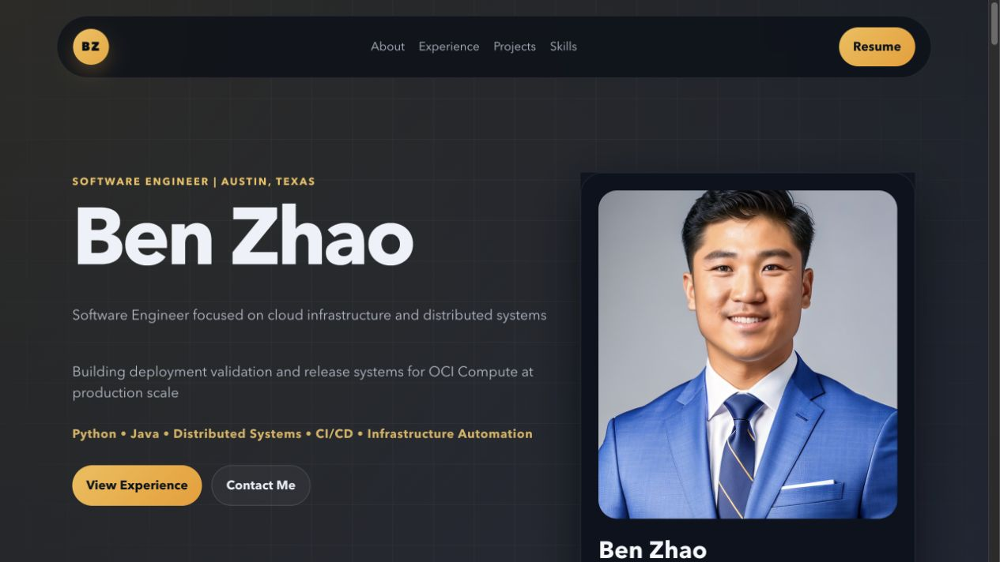
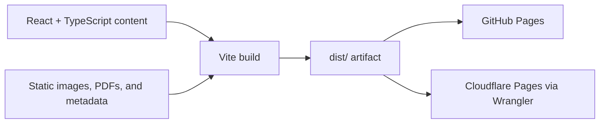

# Ben Zhao — Engineering Portfolio

Source for [zehoubenzhao.com](https://zehoubenzhao.com/), a responsive portfolio focused on cloud infrastructure, distributed systems, deployment safety, and selected engineering projects.



## What is included

- Professional experience and education presented as structured React data.
- Project case studies for RoleFit, CARLA computer vision, and earlier data work.
- Responsive layouts and accessible navigation for desktop and mobile.
- Search and social metadata, canonical URLs, a sitemap, and structured profile data.
- Sanitized downloadable case studies and résumé without a public phone number.
- GitHub Pages deployment with a build check on pull requests.

## Architecture



The site intentionally has no backend. Content lives in `src/App.tsx`, presentation lives in `src/styles.css`, and static documents and images live under `public/`.

## Local development

Requirements:

- Node.js 20.19 or newer
- npm

```bash
git clone https://github.com/bzhao-1/Portfolio-Website.git
cd Portfolio-Website
npm ci
npm run dev
```

Vite prints the local development URL. Changes under `src/` update through hot module replacement.

## Verification and production build

```bash
npm run check
npm run build
npm audit
```

The production output is generated in `dist/` and is not committed. CI performs a clean install and build before GitHub Pages deployment. Pull requests run the same build job without deploying.

## Deployment

Pushes to `main` deploy through `.github/workflows/deploy-pages.yml`. The Vite base path switches to `/Portfolio-Website/` for that target. `wrangler.toml` also describes the Cloudflare Pages output directory used by the custom domain deployment.

## Project structure

```text
.
├── src/                  # React components and styling
├── public/               # Images, PDFs, sitemap, and static headers
├── .github/workflows/    # Build and GitHub Pages deployment
├── index.html            # Metadata and application entry point
├── vite.config.ts        # Build and base-path configuration
└── wrangler.toml         # Cloudflare Pages configuration
```

## License

Source code is available under the [MIT License](LICENSE). Photographs, résumé content, case-study content, and third-party marks remain the property of their respective owners and are not granted for reuse by the software license.
